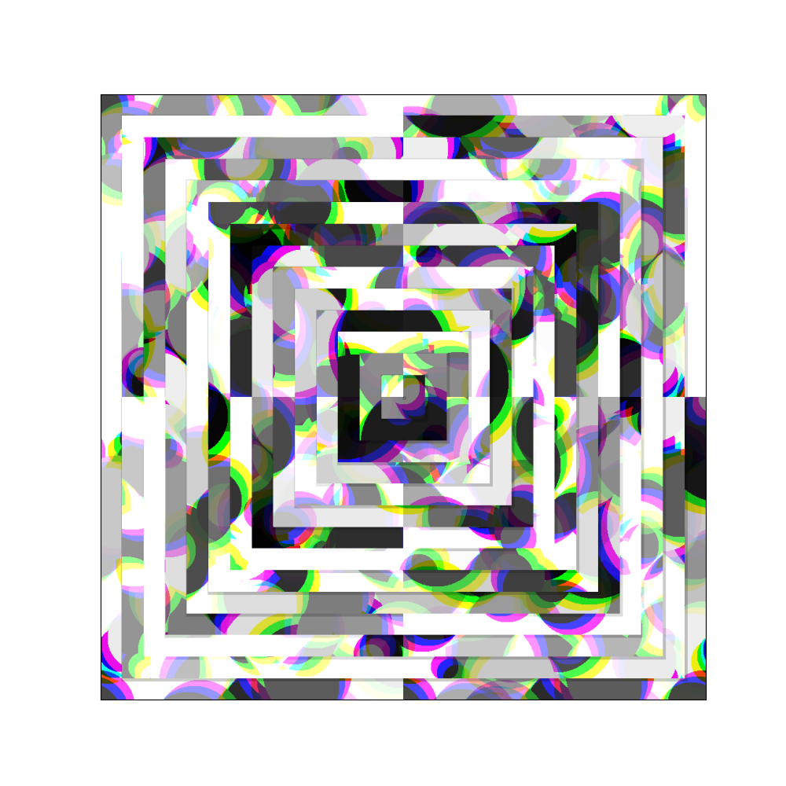

# Genuary 2025

My artwork for [#genuary2025](https://bsky.app/hashtag/genuary2025), when I have time!

Dependencies are managed with `uv`, and you can recreate each image by running the script with the matching day name.

Have fun messing around with them if you'd like :)
